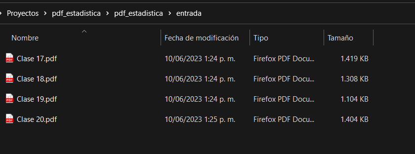
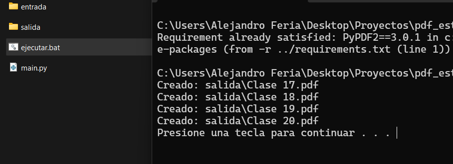

Elimina las diapositivas innecesarias de los pdf de estadística, Unal Medellín.

# Como usar

En la carpeta **pdf_estadistica\entrada**, guarda los pdfs que deseas modificar.

Ejecuta el archivo ***"ejecutar.bat"*** y en la carpeta salida están las nuevas diapositivas.

  

## Ejecutar manualmente

Para ejecutar manualmente se necesita el modulo **PyPDF2**

    pip install PyPDF2

y se ejecuta *main.py*
